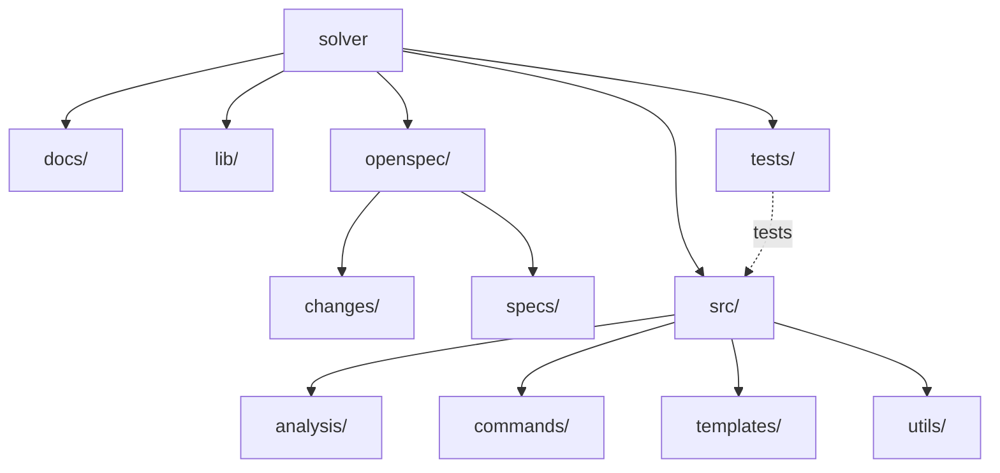

# Solver Scan — solver

## Date: 2026-03-20

## Architecture Overview



## Stack

**Detected framework:** none detected

| Dependency | Version | Type |
| --- | --- | --- |
| chalk | ^5.6.2 | production |
| commander | ^14.0.3 | production |
| @biomejs/biome | ^2.4.8 | dev |
| @types/node | ^25.5.0 | dev |
| typescript | ^5.9.3 | dev |
| vitest | ^4.1.0 | dev |

## What Exists

- **Source files:** 39
- **Test files:** 17
- **Test coverage ratio:** 44%
- **Has CI config:** no
- **Has Dockerfile:** no
- **Has OpenSpec:** yes
- **Has structured logging:** yes
- **Has env validation:** no
- **Has error boundaries:** no

### Directory Structure

```
├── docs/
├── lib/
├── openspec/
│   ├── changes/
│   └── specs/
├── src/
│   ├── analysis/
│   ├── commands/
│   ├── templates/
│   └── utils/
└── tests/
    ├── analysis/
    ├── commands/
    ├── templates/
    └── utils/
```

## What's Missing (engineering quality)

- **Environment validation:** Not detected. No env.ts or .env.example found.
- **Error boundaries:** Not detected. No error.tsx/error.ts files found.
- **CI/CD configuration:** Not detected. No GitHub Actions, GitLab CI, Jenkins, or CircleCI config found.
- **Dockerfile:** Not detected.

## What's Broken

- **Missing dependencies:** 1 package imported in source but not declared in package.json
  - pino
- **Large files (over 400 lines):** 1 file exceeds the threshold
  - src/analysis/collector.ts (460 lines)
- **Low test coverage:** 44% (17 test files for 39 source files). Target is 50% or higher.

## What Could Be Better

### Large Files

| File | Lines |
| --- | --- |
| src/analysis/collector.ts | 460 |

- **Files approaching 400-line threshold (over 300 lines):** 1 file
  - tests/templates/skills/skills.test.ts (348 lines)
- **Test coverage is low:** 44% (17/39). Prioritize adding tests for critical business logic.

## Recommended Next Steps

1. **Install missing dependencies** — 1 package imported but not declared: pino.
2. **Add environment validation** — create lib/env.ts with Zod schema and .env.example.
3. **Add error boundaries** — create error.tsx at minimum at the app root.
4. **Set up CI/CD** — add GitHub Actions or equivalent pipeline.
5. **Improve test coverage** — currently at 44%. Add tests for critical paths to reach 50% minimum.
6. **Split large files** — 1 file exceeds 400 lines. Extract into smaller, focused modules.
